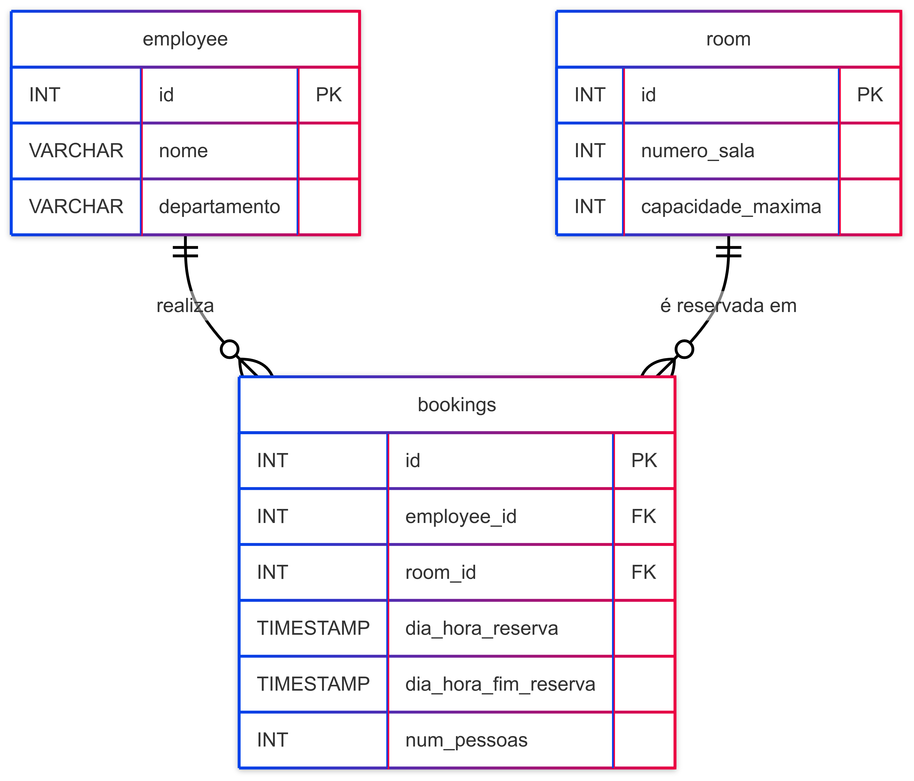
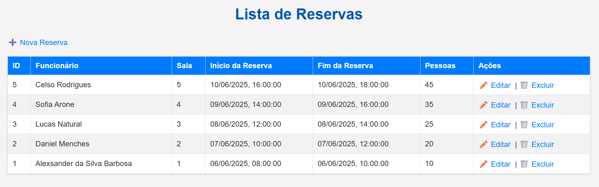
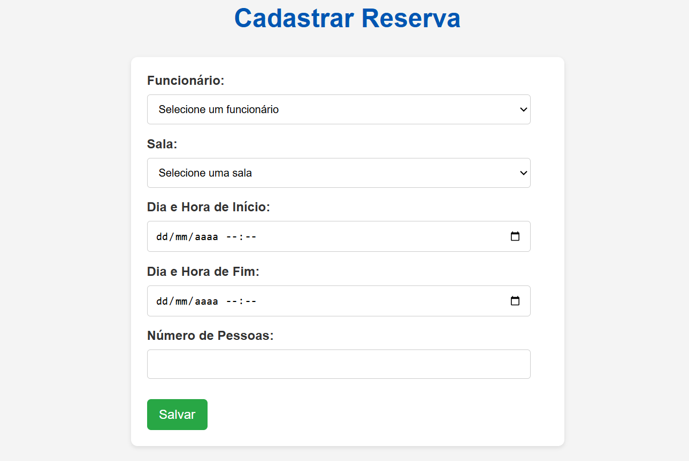
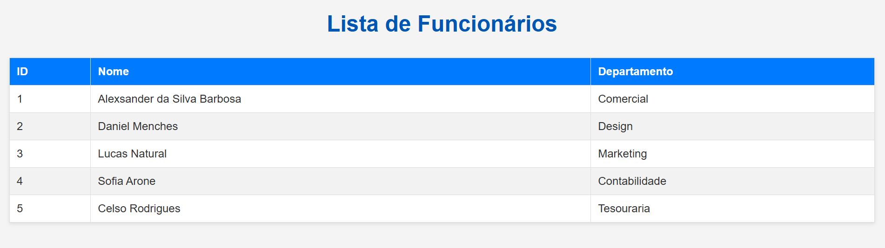
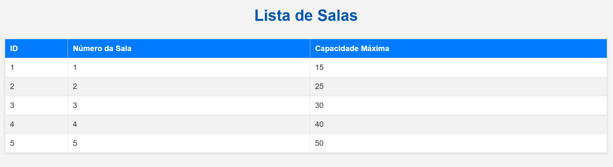

# Reserva de salas - Web Architecture Document (WAD)

## Introdução
Este projeto tem como objetivo oferecer uma solução eficiente para a reserva de salas de reunião por colaboradores de uma empresa. A aplicação foi desenvolvida para otimizar a gestão de espaços compartilhados, permitindo aos usuários visualizar a disponibilidade em tempo real, agendar reservas de forma prática e evitar conflitos de uso. Com isso, busca-se resolver problemas comuns relacionados à previsão e ocupação de salas, promovendo um ambiente de trabalho mais organizado e produtivo.

---

## Decisões Técnicas Principais

Este projeto foi construído sobre uma arquitetura robusta, seguindo o padrão MVC (Model-View-Controller) com a adição de camadas de Serviço e Repositório. Esta abordagem visou promover a **separação de responsabilidades** e a **manutenibilidade** do código.

* **Framework Web:** **Node.js** com **Express.js** foi escolhido para o desenvolvimento do backend, devido à sua flexibilidade, performance para aplicações web e vasta comunidade.

* **Banco de Dados:** **PostgreSQL** é o sistema de gerenciamento de banco de dados relacional utilizado, conhecido por sua robustez, confiabilidade e capacidade de lidar com dados estruturados de forma eficiente. A interação com o banco é feita através da biblioteca `pg`.

* **Arquitetura em Camadas:**
    * **Controllers:** Responsáveis por receber requisições HTTP, coordenar as ações e retornar as respostas (JSON para APIs, renderização de views para páginas).
    * **Services:** Contêm a lógica de negócio principal do sistema, orquestrando operações e aplicando regras específicas (ex: validação de agendamentos, verificação de capacidade).
    * **Repositories:** Abstraem a camada de persistência de dados, comunicando-se diretamente com o banco de dados para realizar operações CRUD.
    * **Models:** Representam a estrutura dos dados e incluem a validação de entrada, utilizando a biblioteca **Joi** para garantir a integridade dos dados antes da persistência.

* **Interface do Usuário (Frontend):** As views são construídas com **EJS**, uma linguagem de template JavaScript, permitindo a renderização dinâmica de páginas HTML no lado do servidor. A interatividade no cliente é implementada com **JavaScript Vanilla** e **CSS Puro**.

* **Variáveis de Ambiente:** O **Dotenv** é utilizado para gerenciar variáveis de ambiente, garantindo que as credenciais do banco de dados e outras configurações sensíveis sejam mantidas fora do código-fonte e possam ser facilmente alteradas entre ambientes.

---

## Principais Aprendizados e Desafios Superados

Durante o desenvolvimento deste projeto, vários aprendizados e desafios foram enfrentados, fortalecendo as habilidades em engenharia de software e resolução de problemas.

* **Aprofundamento em Arquitetura de Software:** A implementação do padrão MVC com as camadas de Service e Repository foi um grande aprendizado, reforçando a importância da modularidade e da separação de responsabilidades para a organização e escalabilidade do código.

* **Validação de Dados no Model:** Entender a importância de mover a lógica de validação do Service para o Model (utilizando Joi) foi crucial. Esse ajuste garantiu que a validação dos dados de entrada ocorra na camada mais adequada, protegendo a integridade do sistema desde o início do fluxo de dados.

* **Gerenciamento de Dependências e Ambientes:** Um dos desafios persistentes foi a configuração correta do `package.json` e do `.env`, especialmente com a decisão de mantê-los dentro da pasta `src/`. Isso exigiu um entendimento aprofundado de como o Node.js resolve módulos (`require()`) e como o `dotenv` localiza o arquivo `.env` a partir de diferentes contextos de execução de scripts (`__dirname` vs. `process.cwd()`), levando a erros de `MODULE_NOT_FOUND` e `ECONNREFUSED`.

* **Depuração de Conexão com Banco de Dados:** A resolução do erro `ECONNREFUSED` demandou uma depuração minuciosa, que ia além do código-fonte, abrangendo a verificação do status do servidor PostgreSQL, configurações de host/porta/credenciais e até mesmo regras de firewall. Isso reforçou a importância de considerar o ambiente completo da aplicação.

* **Organização de Migrações de Banco de Dados:** A transição de um único arquivo SQL para migrações separadas por entidade melhorou significativamente a manutenibilidade e o controle de versão do esquema do banco de dados.

---

## Pontos Fortes do Projeto

* **Arquitetura Limpa e Modular:** A adesão rigorosa ao MVC com camadas de Serviço e Repositório resultou em um código bem organizado, fácil de entender e expandir.

* **Lógica de Negócio Robusta:** As regras de negócio para reserva de salas (duração exata de 2 horas, capacidade máxima, verificação de sobreposição) estão centralizadas no Service, garantindo consistência e tratamento de erros eficaz.

* **Validação de Entrada Sólida:** A implementação do Joi nos Models assegura que apenas dados válidos sejam processados e persistidos, reduzindo a chance de erros no banco de dados.

* **Interface Funcional e Intuitiva:** A aplicação front-end é completa, permitindo a visualização e gestão de reservas, funcionários e salas de forma interativa.

* **Separação entre API e Páginas:** A divisão clara das rotas entre a API REST e as páginas EJS facilita a manutenção e uma futura integração com outros tipos de clientes (como um frontend React/Angular/Vue separado).

* **Tratamento de Erros:** A implementação de um middleware de erro global no Express e blocos `try/catch` nos Controllers e Services garante que os erros sejam capturados, logados e retornados de forma adequada ao cliente.

---

## Pontos a Melhorar e Próximos Passos

Apesar da solidez atual do projeto, há áreas para futuras melhorias e expansão:

* **Testes Automatizados:** Implementar testes unitários para os Models e Services, e testes de integração para as rotas da API. Isso garantiria a estabilidade do código, facilitaria a refatoração e evitaria regressões.

* **Autenticação e Autorização:** Atualmente, o sistema não possui um mecanismo de autenticação de usuários. Adicionar um sistema de login (ex: com JWT) e controle de acesso baseado em funções (quem pode reservar, quem pode gerenciar salas, etc.) seria um próximo passo crucial para a segurança.

* **Refatoração de Migrações (para automação com libs):** Embora a separação das migrações por entidade seja um avanço, a adoção de uma biblioteca de migração (como `Knex.js` ou `node-migrate`) poderia automatizar ainda mais o processo de criação, aplicação e reversão de schemas de banco de dados.

* **Interface do Usuário (UI/UX):** Embora funcional, a interface poderia ser aprimorada com um framework de UI moderno (ex: React, Vue, Angular) para uma experiência de usuário mais rica e reativa, com componentes reutilizáveis e gerenciamento de estado mais sofisticado.

* **Otimização de Queries:** Para aplicações com maior volume de dados, otimizar as queries SQL e implementar cache poderia melhorar o desempenho.

* **Tratamento de Fuso Horário:** Garantir um tratamento consistente de fusos horários para as reservas em diferentes regiões, se a aplicação for usada globalmente.

---

## Modelo relacional do banco de dados



---

## Modelo físico do banco de dados

```sql
CREATE TABLE IF NOT EXISTS employee (
  id SERIAL PRIMARY KEY,
  nome VARCHAR(100) NOT NULL,
  departamento VARCHAR(100) NOT NULL
);

CREATE TABLE IF NOT EXISTS room (
  id SERIAL PRIMARY KEY,
  numero_sala INTEGER NOT NULL UNIQUE,
  capacidade_maxima INTEGER NOT NULL
);

CREATE TABLE IF NOT EXISTS bookings (
  id SERIAL PRIMARY KEY,
  employee_id INTEGER NOT NULL,
  room_id INTEGER NOT NULL,
  dia_hora_reserva TIMESTAMP NOT NULL,
  dia_hora_fim_reserva TIMESTAMP NOT NULL,
  num_pessoas INTEGER NOT NULL,
  FOREIGN KEY (employee_id) REFERENCES employee(id),
  FOREIGN KEY (room_id) REFERENCES room(id),
  UNIQUE (employee_id, room_id, dia_hora_reserva, dia_hora_fim_reserva)
);
```

## Prints das Views (Interface do Usuário)

Esta seção mostra as principais telas da aplicação, demonstrando a interação com o sistema e a exibição dos dados.

### 1. Página de Listagem de Reservas (`/bookings`)

  

### 2. Formulário de Reserva (Criação/Edição - /`bookings/form` ou `/bookings/form/:id`)

  

### 3. Página de Listagem de Funcionários (`/employees`)

  

### 4. Página de Listagem de Salas (`/rooms`)

  